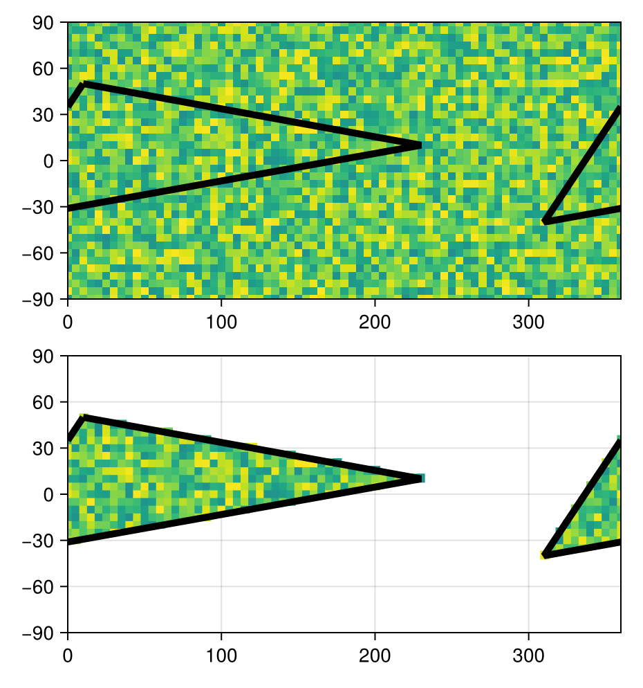

# How do you use RegionGrids.jl? {#How-do-you-use-RegionGrids.jl?}

## The Basic Outline {#The-Basic-Outline}

In practice, we would use GeoRegions and RegionGrids as follows:

```
using GeoRegions
using RegionGrids

# 1. Get gridded data, and longitude/latitude

data = ...
dlon = ... # longitudes for gridded data points
dlat = ... # latitudes for gridded data points

# 2. Define a Geographic Region using a shape defined by vectors for longitude and latitude respectively

geo = GeoRegion(lon,lat)

# 3. Create a RegionGrid for data extraction using the GeoRegion, and longitude and latitude vectors

ggrd = RegionGrid(geo,dlon,dlat)

# 4. Extract the data within the GeoRegion of interest

longitude and latitude vectors respectively
ndata  = extract(data,ggrd)
newlon = ggrd.lon
newlat = ggrd.lat
```


## An Example {#An-Example}

### Setup {#Setup}

```julia
using GeoRegions
using RegionGrids
using DelimitedFiles
using CairoMakie

download("https://raw.githubusercontent.com/natgeo-wong/GeoPlottingData/main/coastline_resl.txt","coast.cst")
coast = readdlm("coast.cst",comments=true)
clon  = coast[:,1]
clat  = coast[:,2]
nothing
```


### Defining some data {#Defining-some-data}

```julia
lon = collect(0:5:360);  nlon = length(lon)
lat = collect(-90:5:90); nlat = length(lat)
data = rand(nlon,nlat)
```


```ansi
73×37 Matrix{Float64}:
 0.00440159  0.968335   0.534061   …  0.193285   0.357873   0.247817
 0.570072    0.428936   0.696678      0.783701   0.171985   0.406605
 0.435381    0.789297   0.449669      0.504048   0.204048   0.809987
 0.620418    0.513647   0.156613      0.904773   0.643986   0.159468
 0.67024     0.516453   0.0500776     0.0542863  0.713617   0.605522
 0.443283    0.0586653  0.642073   …  0.2978     0.155724   0.80504
 0.947825    0.916808   0.154601      0.615859   0.0892943  0.502145
 0.393968    0.333799   0.585571      0.743833   0.428162   0.210438
 0.178654    0.537687   0.104394      0.410878   0.102667   0.0755523
 0.834059    0.79956    0.659215      0.0883291  0.335628   0.666067
 ⋮                                 ⋱             ⋮          
 0.789852    0.240229   0.363184      0.66904    0.200397   0.154712
 0.436126    0.915198   0.267488   …  0.68637    0.154183   0.763927
 0.0943948   0.404005   0.0659952     0.372805   0.503461   0.981964
 0.531781    0.765472   0.86217       0.422707   0.422488   0.627683
 0.603491    0.669209   0.667943      0.773044   0.154128   0.688001
 0.117875    0.945057   0.221726      0.469043   0.677971   0.22347
 0.556722    0.0752979  0.144756   …  0.307695   0.664507   0.952748
 0.720393    0.651511   0.579279      0.130594   0.422861   0.0250154
 0.451337    0.355786   0.40967       0.314262   0.361653   0.0354122
```


### Defining a Region of Interest {#Defining-a-Region-of-Interest}

Next, we proceed to define a GeoRegion and extract its coordinates:

```julia
geo = GeoRegion([10,230,-50,10],[50,10,-40,50])
slon,slat = coordinates(geo) # extract the coordinates
```


```ansi
([10.0, 230.0, -50.0, 10.0], [50.0, 10.0, -40.0, 50.0])
```


### Let us create a RegionGrid for Data Extraction {#Let-us-create-a-RegionGrid-for-Data-Extraction}

Following which, we can define a RegionGrid:

```julia
ggrd = RegionGrid(geo,lon,lat)
```


```ansi
The RLinearMask Grid type has the following properties:
    Longitude Indices     (ilon) : [63, 64, 65, 66, 67, 68, 69, 70, 71, 72  …  38, 39, 40, 41, 42, 43, 44, 45, 46, 47]
    Latitude Indices      (ilat) : [11, 12, 13, 14, 15, 16, 17, 18, 19, 20, 21, 22, 23, 24, 25, 26, 27, 28, 29]
    Longitude Points       (lon) : [-50, -45, -40, -35, -30, -25, -20, -15, -10, -5  …  185, 190, 195, 200, 205, 210, 215, 220, 225, 230]
    Latitude Points        (lat) : [-40, -35, -30, -25, -20, -15, -10, -5, 0, 5, 10, 15, 20, 25, 30, 35, 40, 45, 50]
    Rotated X Coordinates    (X)
    Rotated Y Coordinates    (Y)
    Rotation (°)             (θ) : 0.0
    RegionGrid Mask       (mask)
    RegionGrid Weights (weights)
    RegionGrid Size              : 58 lon points x 19 lat points
    RegionGrid Validity		  : 465 / 1102

```


And then use this RegionGrid to extract data for the GeoRegion of interest:

```julia
ndata = extract(data,ggrd)
```


```ansi
58×19 Matrix{Float64}:
   0.926068  NaN         NaN          …  NaN         NaN  NaN  NaN  NaN  NaN
 NaN           0.515654  NaN             NaN         NaN  NaN  NaN  NaN  NaN
 NaN           0.760041    0.0253373     NaN         NaN  NaN  NaN  NaN  NaN
 NaN           0.354306    0.845835      NaN         NaN  NaN  NaN  NaN  NaN
 NaN           0.390636    0.537546      NaN         NaN  NaN  NaN  NaN  NaN
 NaN           0.77535     0.945165   …  NaN         NaN  NaN  NaN  NaN  NaN
 NaN         NaN           0.594677      NaN         NaN  NaN  NaN  NaN  NaN
 NaN         NaN           0.467853      NaN         NaN  NaN  NaN  NaN  NaN
 NaN         NaN           0.889612      NaN         NaN  NaN  NaN  NaN  NaN
 NaN         NaN           0.537417        0.218302  NaN  NaN  NaN  NaN  NaN
   ⋮                                  ⋱                     ⋮            
 NaN         NaN         NaN             NaN         NaN  NaN  NaN  NaN  NaN
 NaN         NaN         NaN          …  NaN         NaN  NaN  NaN  NaN  NaN
 NaN         NaN         NaN             NaN         NaN  NaN  NaN  NaN  NaN
 NaN         NaN         NaN             NaN         NaN  NaN  NaN  NaN  NaN
 NaN         NaN         NaN             NaN         NaN  NaN  NaN  NaN  NaN
 NaN         NaN         NaN             NaN         NaN  NaN  NaN  NaN  NaN
 NaN         NaN         NaN          …  NaN         NaN  NaN  NaN  NaN  NaN
 NaN         NaN         NaN             NaN         NaN  NaN  NaN  NaN  NaN
 NaN         NaN         NaN             NaN         NaN  NaN  NaN  NaN  NaN
```


### Data Visualization {#Data-Visualization}

```julia
fig = Figure()

ax1 = Axis(
    fig[1,1],width=400,height=200,
    limits=(0,360,-90,90)
)
heatmap!(ax1,lon,lat,data,colorrange=(-1,1))
lines!(ax1,slon,slat,color=:black,linewidth=5)
lines!(ax1,slon.+360,slat,color=:black,linewidth=5)

ax2 = Axis(
    fig[2,1],width=400,height=200,
    limits=(0,360,-90,90)
)
heatmap!(ax2,ggrd.lon,ggrd.lat,ndata,colorrange=(-1,1))
heatmap!(ax2,ggrd.lon.+360,ggrd.lat,ndata,colorrange=(-1,1))
lines!(ax2,slon,slat,color=:black,linewidth=5)
lines!(ax2,slon.+360,slat,color=:black,linewidth=5)

resize_to_layout!(fig)
fig
```

{width=465px height=497px}
