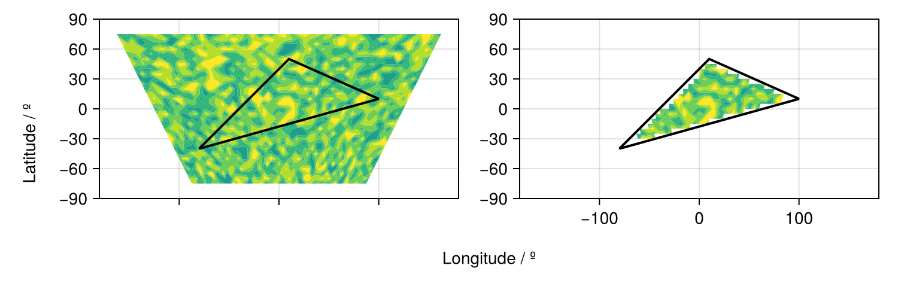

# Generalized Grids for Data Extraction {#Generalized-Grids-for-Data-Extraction}

Not all longitude-latitude grids are rectilinear in the lon/lat space. `RegionGrid` classifies this type as a `GeneralizedGrid`. Examples of such datasets include:
- [Level 2 products from the Global Precipitation Measurement Mission](https://gpm.nasa.gov/data/directory)
  
- Model output from climate models such as [Weather Research &amp; Forecasting Model (WRF)](https://www.mmm.ucar.edu/models/wrf)
  

Basically, for each of these datasets, the data is given in such a way that the coordinates of the grid can be expressed via:
- A 2D array of `Point2` types, with each `Point2` type containing (lon,lat)
  

```julia
using GeoRegions
using RegionGrids
using CairoMakie
```


## Creating Generalized Grids {#Creating-Generalized-Grids}

A Generalized Grid can be created as follows:

```
ggrd = RegionGrid(geo,Point2.(lon,lat))
```


where `geo` is a `GeoRegion` of interest that is found within the domain defined by the longitude and latitude grid vectors.

```julia
nlon = 51; nlat = 31
lon = zeros(nlon,nlat)
lat = zeros(nlon,nlat)
for ilat = 1 : nlat, ilon = 1 : nlon
    lon[ilon,ilat] = (ilon-26) * (5 + (ilat-16) * 0.1)
    lat[ilon,ilat] = (ilat-16) * 5
end
geo = GeoRegion([10,100,-80,10],[50,10,-40,50])

ggrd = RegionGrid(geo,Point2.(lon,lat))
```


```ansi
The GeneralMask type has the following properties:
    Longitude Indices     (ilon)
    Latitude Indices      (ilat)
    Longitude Points       (lon)
    Latitude Points        (lat)
    Rotated X Coordinates    (X)
    Rotated Y Coordinates    (Y)
    Rotation (°)             (θ) : 0.0
    RegionGrid Mask       (mask)
    RegionGrid Weights (weights)
    RegionGrid Size 	          : 37 lon points x 17 lat points
    RegionGrid Validity          : 230 / 629

```


The API for creating a Generalized Grid can be found [here](generalized.md)

## What is in a Generalized Grid? {#What-is-in-a-Generalized-Grid?}
<details class='jldocstring custom-block' open>
<summary><a id='RegionGrids.GeneralizedGrid' href='#RegionGrids.GeneralizedGrid'><span class="jlbinding">RegionGrids.GeneralizedGrid</span></a> <Badge type="info" class="jlObjectType jlType" text="Type" /></summary>


```julia
GeneralizedGrid <: RegionGrid
```


A `GeneralizedGrid` is a `RegionGrid` that is created based on longitude/latitude grids that are **not** rectilinear - this can range from curvilinear grids to unstructured grids. It has its own subtypes: `RegionMask` and `VectorMask`.

All `GeneralizedGrid` type will contain the following fields:
- `lon` - A Matrix of `Float`s, defining the longitudes for each point in the RegionGrid that describe the region.
  
- `lat` - A Matrix of `Float`s, defining the latitude for each point in the RegionGrid that describe the region.
  
- `ilon` - A Matrix of `Int`s, defining the indices used to extract the longitude vector from the input longitude vector.
  
- `ilat` - A Matrix of `Int`s, defining the indices used to extract the latitude vector from the input latitude vector.
  
- `mask` - An Matrix of NaNs and 1s, defining the gridpoints in the RegionGrid where the data is valid.
  
- `weights` - A Matrix of `Float`s, defining the latitude-weights of each valid point in the grid. Will be NaN if outside the bounds of the GeoRegion used to define this RectilinearGrid.
  
- `X` - A Matrix of `Float`s, defining the X-coordinates (in meters) of each point in the &quot;derotated&quot; RegionGrid about the centroid for the shape of the GeoRegion.
  
- `Y` - A Matrix of `Float`s, defining the Y-coordinates (in meters) of each point in the &quot;derotated&quot; RegionGrid about the centroid for the shape of the GeoRegion.
  
- `θ` - A `Float` storing the information on the angle (in degrees) about which the data was rotated in the anti-clockwise direction. Mathematically, it is `rotation - geo.θ`.
  


<Badge type="info" class="source-link" text="source"><a href="https://github.com/GeoRegionsEcosystem/RegionGrids.jl/blob/76b08e60c5e247b3d19d7bc8a2ac1e2ad086691a/src/RegionGrids.jl#L52-L67" target="_blank" rel="noreferrer">source</a></Badge>

</details>


We see that in a `GeneralizedGrid` type, we have the `lon` and `lat` arrays that defined the longitude and latitude points that have been cropped to fit the GeoRegion bounds.

```julia
ggrd.lon
```


```ansi
37×17 Matrix{Float64}:
 -73.1  -74.8  -76.5  -78.2  -79.9  …  266.5  264.8  263.1  261.4  259.7
 -68.8  -70.4  -72.0  -73.6  -75.2     272.0  270.4  268.8  267.2  265.6
 -64.5  -66.0  -67.5  -69.0  -70.5     277.5  276.0  274.5  273.0  271.5
 -60.2  -61.6  -63.0  -64.4  -65.8     -77.0  -78.4  -79.8  278.8  277.4
 -55.9  -57.2  -58.5  -59.8  -61.1     -71.5  -72.8  -74.1  -75.4  -76.7
 -51.6  -52.8  -54.0  -55.2  -56.4  …  -66.0  -67.2  -68.4  -69.6  -70.8
 -47.3  -48.4  -49.5  -50.6  -51.7     -60.5  -61.6  -62.7  -63.8  -64.9
 -43.0  -44.0  -45.0  -46.0  -47.0     -55.0  -56.0  -57.0  -58.0  -59.0
 -38.7  -39.6  -40.5  -41.4  -42.3     -49.5  -50.4  -51.3  -52.2  -53.1
 -34.4  -35.2  -36.0  -36.8  -37.6     -44.0  -44.8  -45.6  -46.4  -47.2
   ⋮                                ⋱                         ⋮    
  47.3   48.4   49.5   50.6   51.7      60.5   61.6   62.7   63.8   64.9
  51.6   52.8   54.0   55.2   56.4      66.0   67.2   68.4   69.6   70.8
  55.9   57.2   58.5   59.8   61.1  …   71.5   72.8   74.1   75.4   76.7
  60.2   61.6   63.0   64.4   65.8      77.0   78.4   79.8   81.2   82.6
  64.5   66.0   67.5   69.0   70.5      82.5   84.0   85.5   87.0   88.5
  68.8   70.4   72.0   73.6   75.2      88.0   89.6   91.2   92.8   94.4
  73.1   74.8   76.5   78.2   79.9      93.5   95.2   96.9   98.6  100.3
  77.4   79.2   81.0   82.8   84.6  …   99.0  100.8  102.6  104.4  106.2
  81.7   83.6   85.5   87.4   89.3     104.5  106.4  108.3  110.2  112.1
```


```julia
ggrd.lat
```


```ansi
37×17 Matrix{Float64}:
 -35.0  -30.0  -25.0  -20.0  -15.0  …  20.0  25.0  30.0  35.0  40.0  45.0
 -35.0  -30.0  -25.0  -20.0  -15.0     20.0  25.0  30.0  35.0  40.0  45.0
 -35.0  -30.0  -25.0  -20.0  -15.0     20.0  25.0  30.0  35.0  40.0  45.0
 -35.0  -30.0  -25.0  -20.0  -15.0     20.0  25.0  30.0  35.0  40.0  45.0
 -35.0  -30.0  -25.0  -20.0  -15.0     20.0  25.0  30.0  35.0  40.0  45.0
 -35.0  -30.0  -25.0  -20.0  -15.0  …  20.0  25.0  30.0  35.0  40.0  45.0
 -35.0  -30.0  -25.0  -20.0  -15.0     20.0  25.0  30.0  35.0  40.0  45.0
 -35.0  -30.0  -25.0  -20.0  -15.0     20.0  25.0  30.0  35.0  40.0  45.0
 -35.0  -30.0  -25.0  -20.0  -15.0     20.0  25.0  30.0  35.0  40.0  45.0
 -35.0  -30.0  -25.0  -20.0  -15.0     20.0  25.0  30.0  35.0  40.0  45.0
   ⋮                                ⋱                           ⋮    
 -35.0  -30.0  -25.0  -20.0  -15.0     20.0  25.0  30.0  35.0  40.0  45.0
 -35.0  -30.0  -25.0  -20.0  -15.0     20.0  25.0  30.0  35.0  40.0  45.0
 -35.0  -30.0  -25.0  -20.0  -15.0  …  20.0  25.0  30.0  35.0  40.0  45.0
 -35.0  -30.0  -25.0  -20.0  -15.0     20.0  25.0  30.0  35.0  40.0  45.0
 -35.0  -30.0  -25.0  -20.0  -15.0     20.0  25.0  30.0  35.0  40.0  45.0
 -35.0  -30.0  -25.0  -20.0  -15.0     20.0  25.0  30.0  35.0  40.0  45.0
 -35.0  -30.0  -25.0  -20.0  -15.0     20.0  25.0  30.0  35.0  40.0  45.0
 -35.0  -30.0  -25.0  -20.0  -15.0  …  20.0  25.0  30.0  35.0  40.0  45.0
 -35.0  -30.0  -25.0  -20.0  -15.0     20.0  25.0  30.0  35.0  40.0  45.0
```


## An example of using Generalized Grids {#An-example-of-using-Generalized-Grids}

Say we have some sample data, here randomly generated.

```julia
data = rand(nlon,nlat)
```


```ansi
51×31 Matrix{Float64}:
 0.86069    0.588488   0.395789   …  0.904763    0.759643   0.324551
 0.673219   0.638474   0.100281      0.594027    0.0752926  0.283861
 0.196273   0.655679   0.276744      0.727587    0.592717   0.101965
 0.380941   0.0953585  0.204207      0.0441412   0.0937708  0.594094
 0.412393   0.547911   0.883978      0.231529    0.2628     0.809845
 0.244429   0.256637   0.29433    …  0.228796    0.550752   0.628433
 0.498277   0.112946   0.87201       0.368792    0.502298   0.969136
 0.333541   0.745412   0.994464      0.1414      0.836657   0.318425
 0.435876   0.286429   0.0550869     0.00167621  0.114547   0.259596
 0.261257   0.0454801  0.294629      0.859353    0.061027   0.815248
 ⋮                                ⋱                         ⋮
 0.0676547  0.374605   0.940851      0.0380016   0.579213   0.483597
 0.191799   0.0264501  0.0716587     0.67386     0.860841   0.378695
 0.964779   0.879531   0.605898      0.151408    0.551328   0.647622
 0.613831   0.0416177  0.435178   …  0.755404    0.0707015  0.319354
 0.441878   0.524102   0.174875      0.905085    0.788606   0.304571
 0.854171   0.423755   0.843501      0.111799    0.549237   0.826291
 0.434642   0.463804   0.286001      0.899965    0.98883    0.961471
 0.0284279  0.799946   0.0936476     0.252534    0.582006   0.567655
 0.470447   0.286742   0.932779   …  0.420149    0.577459   0.0307914
```


We extract the valid data within the GeoRegion of interest that we defined above:

```julia
ndata = extract(data,ggrd)
```


```ansi
37×17 Matrix{Float64}:
   0.48504   NaN          NaN          …  NaN         NaN  NaN  NaN  NaN
   0.615387  NaN          NaN             NaN         NaN  NaN  NaN  NaN
   0.459089    0.9615     NaN             NaN         NaN  NaN  NaN  NaN
 NaN           0.0677399    0.212373      NaN         NaN  NaN  NaN  NaN
 NaN           0.94868      0.0772484     NaN         NaN  NaN  NaN  NaN
 NaN           0.95317      0.215549   …  NaN         NaN  NaN  NaN  NaN
 NaN           0.845284     0.542682      NaN         NaN  NaN  NaN  NaN
 NaN           0.590052     0.337944      NaN         NaN  NaN  NaN  NaN
 NaN         NaN            0.764298      NaN         NaN  NaN  NaN  NaN
 NaN         NaN            0.819848      NaN         NaN  NaN  NaN  NaN
   ⋮                                   ⋱                          ⋮  
 NaN         NaN          NaN               0.394325  NaN  NaN  NaN  NaN
 NaN         NaN          NaN               0.882477  NaN  NaN  NaN  NaN
 NaN         NaN          NaN          …  NaN         NaN  NaN  NaN  NaN
 NaN         NaN          NaN             NaN         NaN  NaN  NaN  NaN
 NaN         NaN          NaN             NaN         NaN  NaN  NaN  NaN
 NaN         NaN          NaN             NaN         NaN  NaN  NaN  NaN
 NaN         NaN          NaN             NaN         NaN  NaN  NaN  NaN
 NaN         NaN          NaN          …  NaN         NaN  NaN  NaN  NaN
 NaN         NaN          NaN             NaN         NaN  NaN  NaN  NaN
```


And now let us visualize the results.

```julia
slon,slat = coordinates(geo) # extract the coordinates
fig = Figure()

ax1 = Axis(
    fig[1,1],width=300,height=150,
    limits=(-180,180,-90,90)
)
contourf!(ax1,lon,lat,data,levels=-1:0.2:1)
lines!(ax1,slon,slat,color=:black,linewidth=2)
lines!(ax1,slon.+360,slat,color=:black,linewidth=2,linestyle=:dash)

hidexdecorations!(ax1,ticks=false,grid=false)

ax2 = Axis(
    fig[1,2],width=300,height=150,
    limits=(-180,180,-90,90)
)
contourf!(ax2,ggrd.lon,ggrd.lat,ndata,levels=-1:0.2:1)
lines!(ax2,slon,slat,color=:black,linewidth=2)

Label(fig[2,:],"Longitude / º")
Label(fig[:,0],"Latitude / º",rotation=pi/2)

resize_to_layout!(fig)
fig
```

{width=750px height=240px}
