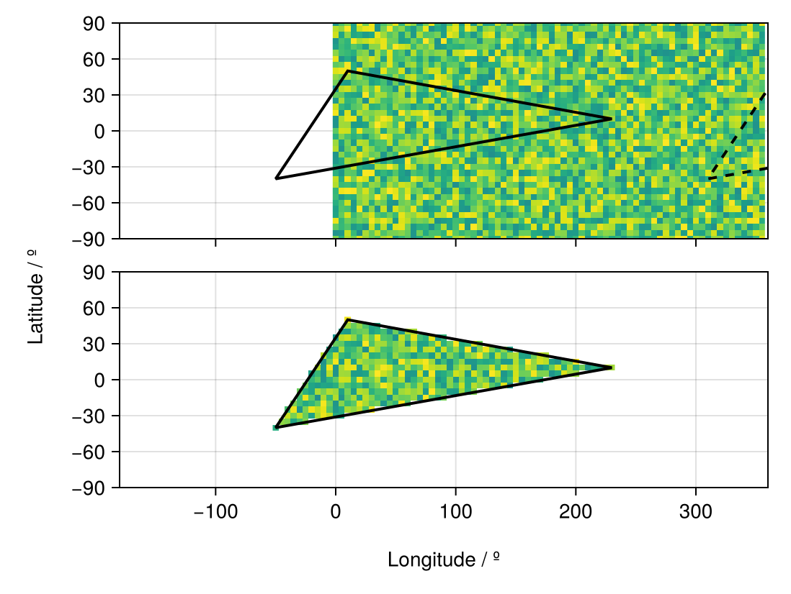

# Rectilinear Grids for Data Extraction {#Rectilinear-Grids-for-Data-Extraction}

The most straightforward of the `RegionGrid` types is the `RectilinearGrid`. This is the type that is used for most datasets on a rectilinear longitude/latitude grid. Examples of such datasets include:
- [Level 3 products from the Global Precipitation Measurement Mission](https://gpm.nasa.gov/data/directory)
  
- Final regridded products from reanalysis such as [ERA5](https://www.ecmwf.int/en/forecasts/dataset/ecmwf-reanalysis-v5) and [MERRA2](https://gmao.gsfc.nasa.gov/reanalysis/merra-2/)
  
- Model output from simple climate models such as [Isca](https://github.com/ExeClim/Isca) and [SpeedyWeather.jl](https://github.com/SpeedyWeather/SpeedyWeather.jl)
  

Basically, for each of these datasets, the data is given in such a way that the coordinates of the grid can be expressed via two vectors/ranges:
- A vector/range of longitudes
  
- A vector/range of latitudes
  

```julia
using GeoRegions
using RegionGrids
using CairoMakie
```


## Creating Rectilinear Grids {#Creating-Rectilinear-Grids}

A Rectilinear Grid can be created as follows:

```
ggrd = RegionGrid(geo,lon,lat)
```


where `geo` is a `GeoRegion` of interest that is found within the domain defined by the longitude and latitude grid vectors.

```julia
lon = collect(0:5:359);  nlon = length(lon)
lat = collect(-90:5:90); nlat = length(lat)
geo = GeoRegion([10,230,-50,10],[50,10,-40,50])

ggrd = RegionGrid(geo,lon,lat)
```


```ansi
The RLinearMask Grid type has the following properties:
    Longitude Indices     (ilon) : [63, 64, 65, 66, 67, 68, 69, 70, 71, 72  …  38, 39, 40, 41, 42, 43, 44, 45, 46, 47]
    Latitude Indices      (ilat) : [11, 12, 13, 14, 15, 16, 17, 18, 19, 20, 21, 22, 23, 24, 25, 26, 27, 28, 29]
    Longitude Points       (lon) : [-50, -45, -40, -35, -30, -25, -20, -15, -10, -5  …  185, 190, 195, 200, 205, 210, 215, 220, 225, 230]
    Latitude Points        (lat) : [-40, -35, -30, -25, -20, -15, -10, -5, 0, 5, 10, 15, 20, 25, 30, 35, 40, 45, 50]
    Rotated X Coordinates    (X)
    Rotated Y Coordinates    (Y)
    Rotation (°)             (θ) : 0.0
    RegionGrid Mask       (mask)
    RegionGrid Weights (weights)
    RegionGrid Size              : 57 lon points x 19 lat points
    RegionGrid Validity		  : 451 / 1083

```


The API for creating a Rectilinear Grid can be found [here](rectilinear.md)

## What is in a Rectilinear Grid? {#What-is-in-a-Rectilinear-Grid?}
<details class='jldocstring custom-block' open>
<summary><a id='RegionGrids.RectilinearGrid' href='#RegionGrids.RectilinearGrid'><span class="jlbinding">RegionGrids.RectilinearGrid</span></a> <Badge type="info" class="jlObjectType jlType" text="Type" /></summary>


```julia
RectilinearGrid <: RegionGrid
```


A `RectilinearGrid` is a `RegionGrid` that is created based on rectilinear longitude/latitude grids. It has its own subtypes: `RectGrid`, `TiltGrid` and `PolyGrid`.

All `RectilinearGrid` types contain the following fields:
- `lon` - A Vector of `Float`s, defining the longitude vector describing the region.
  
- `lat` - A Vector of `Float`s, defining the latitude vector describing the region.
  
- `ilon` - A Vector of `Int`s, defining the indices used to extract the longitude vector from the input longitude vector.
  
- `ilat` - A Vector of `Int`s, defining the indices used to extract the latitude vector from the input latitude vector.
  
- `mask` - An Array of NaNs and 1s, defining the gridpoints in the RegionGrid where the data is valid.
  
- `weights` - A Vector of `Float`s, defining the latitude-weights of each valid point in the grid. Will be NaN if outside the bounds of the GeoRegion used to define this RectilinearGrid.
  
- `X` - A Vector of `Float`s, defining the X-coordinates (in meters) of each point in the &quot;derotated&quot; RegionGrid about the centroid for the shape of the GeoRegion.
  
- `Y` - A Vector of `Float`s, defining the Y-coordinates (in meters) of each point in the &quot;derotated&quot; RegionGrid about the centroid for the shape of the GeoRegion.
  
- `θ` - A `Float` storing the information on the angle (in degrees) about which the data was rotated in the anti-clockwise direction. Mathematically, it is `rotation - geo.θ`.
  


<Badge type="info" class="source-link" text="source"><a href="https://github.com/GeoRegionsEcosystem/RegionGrids.jl/blob/76b08e60c5e247b3d19d7bc8a2ac1e2ad086691a/src/RegionGrids.jl#L24-L39" target="_blank" rel="noreferrer">source</a></Badge>

</details>


We see that in a `RectilinearGrid` type, we have the `lon` and `lat` fields that defined the longitude and latitude vectors that have been cropped to fit the GeoRegion bounds.

```julia
ggrd.lon, ggrd.lat
```


```ansi
([-50, -45, -40, -35, -30, -25, -20, -15, -10, -5  …  185, 190, 195, 200, 205, 210, 215, 220, 225, 230], [-40, -35, -30, -25, -20, -15, -10, -5, 0, 5, 10, 15, 20, 25, 30, 35, 40, 45, 50])
```


## An example of using Rectilinear Grids {#An-example-of-using-Rectilinear-Grids}

Say we have some sample data, here randomly generated.

```julia
data = rand(nlon,nlat)
```


```ansi
72×37 Matrix{Float64}:
 0.615136     0.0304978    0.513026   …  0.854212  0.78518    0.0529548
 0.272558     0.0685999    0.339852      0.175893  0.687096   0.444963
 0.762599     0.824733     0.454694      0.655499  0.983824   0.627918
 0.571207     0.342857     0.0836068     0.18275   0.17345    0.116055
 0.909759     0.000146811  0.205179      0.246194  0.822392   0.951369
 0.708977     0.746555     0.022471   …  0.097118  0.935391   0.542021
 0.54332      0.524096     0.848722      0.183348  0.95345    0.96067
 0.455375     0.804794     0.267354      0.936246  0.0159658  0.0387637
 0.749357     0.444011     0.7949        0.712503  0.580612   0.435985
 0.831098     0.591702     0.138665      0.478121  0.977681   0.628826
 ⋮                                    ⋱            ⋮          
 0.695229     0.871782     0.0116356     0.868541  0.163901   0.950166
 0.675239     0.0917272    0.831568      0.628359  0.0185469  0.803879
 0.254115     0.325645     0.438647   …  0.736568  0.714685   0.647282
 0.6977       0.656415     0.578508      0.700111  0.514741   0.24717
 0.177777     0.527457     0.181649      0.675745  0.615454   0.0214532
 0.0940918    0.135953     0.613437      0.378022  0.803007   0.264404
 0.000191037  0.514563     0.0886625     0.977258  0.843728   0.907627
 0.339058     0.853342     0.305252   …  0.723812  0.261043   0.242435
 0.907169     0.755355     0.553717      0.10696   0.273877   0.953315
```


We extract the valid data within the GeoRegion of interest that we defined above:

```julia
ndata = extract(data,ggrd)
```


```ansi
57×19 Matrix{Float64}:
   0.235124  NaN         NaN         …  NaN         NaN  NaN  NaN  NaN  NaN
 NaN           0.671433  NaN            NaN         NaN  NaN  NaN  NaN  NaN
 NaN           0.615514    0.836178     NaN         NaN  NaN  NaN  NaN  NaN
 NaN           0.176912    0.590538     NaN         NaN  NaN  NaN  NaN  NaN
 NaN           0.415122    0.811611     NaN         NaN  NaN  NaN  NaN  NaN
 NaN           0.615608    0.537477  …  NaN         NaN  NaN  NaN  NaN  NaN
 NaN         NaN           0.146471     NaN         NaN  NaN  NaN  NaN  NaN
 NaN         NaN           0.73903      NaN         NaN  NaN  NaN  NaN  NaN
 NaN         NaN           0.952297     NaN         NaN  NaN  NaN  NaN  NaN
 NaN         NaN           0.815835       0.202604  NaN  NaN  NaN  NaN  NaN
   ⋮                                 ⋱                     ⋮            
 NaN         NaN         NaN            NaN         NaN  NaN  NaN  NaN  NaN
 NaN         NaN         NaN            NaN         NaN  NaN  NaN  NaN  NaN
 NaN         NaN         NaN         …  NaN         NaN  NaN  NaN  NaN  NaN
 NaN         NaN         NaN            NaN         NaN  NaN  NaN  NaN  NaN
 NaN         NaN         NaN            NaN         NaN  NaN  NaN  NaN  NaN
 NaN         NaN         NaN            NaN         NaN  NaN  NaN  NaN  NaN
 NaN         NaN         NaN            NaN         NaN  NaN  NaN  NaN  NaN
 NaN         NaN         NaN         …  NaN         NaN  NaN  NaN  NaN  NaN
 NaN         NaN         NaN            NaN         NaN  NaN  NaN  NaN  NaN
```


And now let us visualize the results.

```julia
slon,slat = coordinates(geo) # extract the coordinates
fig = Figure()

ax1 = Axis(
    fig[1,1],width=450,height=150,
    limits=(-180,360,-90,90)
)
heatmap!(ax1,lon,lat,data,colorrange=(-1,1))
lines!(ax1,slon,slat,color=:black,linewidth=2)
lines!(ax1,slon.+360,slat,color=:black,linewidth=2,linestyle=:dash)

hidexdecorations!(ax1,ticks=false,grid=false)

ax2 = Axis(
    fig[2,1],width=450,height=150,
    limits=(-180,360,-90,90)
)
heatmap!(ax2,ggrd.lon,ggrd.lat,ndata,colorrange=(-1,1))
lines!(ax2,slon,slat,color=:black,linewidth=2)

Label(fig[3,:],"Longitude / º")
Label(fig[:,0],"Latitude / º",rotation=pi/2)

resize_to_layout!(fig)
fig
```

{width=549px height=413px}
