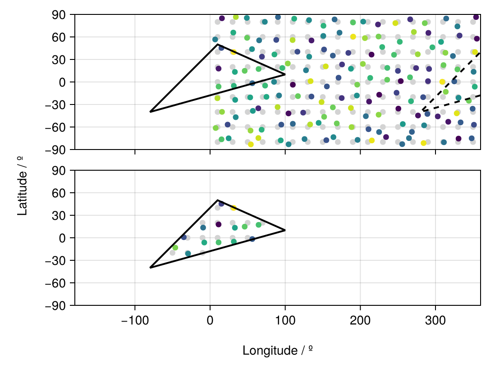

# Unstructured Grids for Data Extraction {#Unstructured-Grids-for-Data-Extraction}

There are also `RegionGrid` types without an actual grid, maybe there are a set of coordinates and geometries that define the corners or the centres of a mesh, such as:
- Model output from climate models such as cubed-sphere mesh output of the [Community Earth Systems Model 2 (CESM2)](https://www.cesm.ucar.edu/models/cesm2).
  

Basically, for each of these datasets, the data is given in such a way that the coordinates of the grid can be expressed via:
- A Vector of `Point2` types, with each `Point2` type containing (lon,lat)
  

```julia
using GeoRegions
using RegionGrids
using CairoMakie
```


## Creating Unstructured Grids {#Creating-Unstructured-Grids}

A Unstructured Grid can be created as follows:

```
ggrd = RegionGrid(geo,Point2.(lon,lat))
```


where `geo` is a `GeoRegion` of interest that is found within the domain defined by the longitude and latitude grid vectors.

```julia
lon = collect(10:20:360); nlon = length(lon)
lat = collect(-80:20:90); nlat = length(lat)

glon = zeros(nlon,nlat); glon .= lon;  glon = glon[:]
glat = zeros(nlon,nlat); glat .= lat'; glat = glat[:]

plon = glon .+ 14rand(nlon*nlat) .- 7
plat = glat .+ 14rand(nlon*nlat) .- 7

geo = GeoRegion([10,100,-80,10],[50,10,-40,50])

iggrd = RegionGrid(geo,Point2.(glon,glat))
pggrd = RegionGrid(geo,Point2.(plon,plat))
```


```ansi
The VectorMask Grid type has the following properties:
    Indices             (ipoint) : [70, 71, 73, 74, 75, 89, 90, 91, 92, 93, 94, 108, 109, 110]
    Longitude Points       (lon) : [-46.32796947989226, -29.31015901079803, 11.320332854542507, 31.592812056403133, 56.179790505332946, -35.009515797953384, -7.722118252292489, 11.311508133624361, 33.010334725676536, 46.04182862410717, 64.5396762181929, -9.276400030029436, 15.073213118555483, 31.454813465218095]
    Latitude Points        (lat) : [-13.111229929770788, -21.085822973125968, -6.156042061033063, -5.170550559198886, -1.6709128711812635, 0.7601438048102409, -6.312210609688788, 17.795471455091004, 13.407178058489542, 14.829291423968254, 17.256153864547308, 13.56397842980559, 45.338496904575145, 39.81124998032526]
    Rotated X Coordinates    (X)
    Rotated Y Coordinates    (Y)
    Rotation (°)             (θ) : 0.0
    RegionGrid Weights (weights)
    RegionGrid Size 			  : (14,) points

```


The API for creating a Unstructured Grid can be found [here](unstructured.md)

## What is in a Unstructured Grid? {#What-is-in-a-Unstructured-Grid?}
<details class='jldocstring custom-block' open>
<summary><a id='RegionGrids.UnstructuredGrid' href='#RegionGrids.UnstructuredGrid'><span class="jlbinding">RegionGrids.UnstructuredGrid</span></a> <Badge type="info" class="jlObjectType jlType" text="Type" /></summary>


```julia
UnstructuredGrid <: RegionGrid
```


A `UnstructuredGrid` is a `RegionGrid` that is created based on an unstructured grid often used in cubed-sphere or unstructured-mesh grids.

All `UnstructuredGrid` type will contain the following fields:
- `lon` - A Vector of `Float`s, defining the longitudes for each point in the RegionGrid that describe the region.
  
- `lat` - A Vector of `Float`s, defining the latitude for each point in the RegionGrid that describe the region.
  
- `ipoint` - A Vector of `Int`s, defining the indices of the valid points from the original unstructured grid that were extracted into the RegionGrid.
  
- `weights` - A Vector of `Float`s, defining the latitude-weights of each valid point in the grid. Will be NaN if outside the bounds of the GeoRegion used to define this RectilinearGrid.
  
- `X` - A Vector of `Float`s, defining the X-coordinates (in meters) of each point in the &quot;derotated&quot; RegionGrid about the centroid for the shape of the GeoRegion.
  
- `Y` - A Vector of `Float`s, defining the Y-coordinates (in meters) of each point in the &quot;derotated&quot; RegionGrid about the centroid for the shape of the GeoRegion.
  
- `θ` - A `Float` storing the information on the angle (in degrees) about which the data was rotated in the anti-clockwise direction. Mathematically, it is `rotation - geo.θ`.
  


<Badge type="info" class="source-link" text="source"><a href="https://github.com/GeoRegionsEcosystem/RegionGrids.jl/blob/76b08e60c5e247b3d19d7bc8a2ac1e2ad086691a/src/RegionGrids.jl#L80-L93" target="_blank" rel="noreferrer">source</a></Badge>

</details>


We see that in a `UnstructuredGrid` type, we have the `lon` and `lat` vectors that defined the longitude and latitude points that are within the GeoRegion.

```@example unstructured
ggrd.lon
```


```@example unstructured
ggrd.lat
```


## An example of using Unstructured Grids {#An-example-of-using-Unstructured-Grids}

Say we have some sample data, here randomly generated.

```julia
data = rand(nlon,nlat)[:]
```


```ansi
162-element Vector{Float64}:
 0.7231967472856025
 0.5397482352659446
 0.956411244949216
 0.9235127277908871
 0.5836405679364466
 0.45463658605437396
 0.4215082287341707
 0.2527903031407669
 0.46460796240062086
 0.42637206414151696
 ⋮
 0.736149874785408
 0.5029305795142521
 0.1111978389511753
 0.9343651554526882
 0.1524950858715104
 0.7880485128745516
 0.34854420907942574
 0.42959337720152524
 0.03416825031118431
```


We extract the valid data within the GeoRegion of interest that we defined above:

```julia
ndata = extract(data,iggrd)
pdata = extract(data,pggrd)
```


```ansi
14-element Vector{Float64}:
 0.8118635143409333
 0.48554581493367643
 0.7265179292842827
 0.648120711271876
 0.32856659625392926
 0.2923630075308069
 0.6322495490388684
 0.0653830730041618
 0.5971378558298104
 0.756673637165569
 0.7208034681745183
 0.41071996247985953
 0.24707106619862762
 0.9954496769168223
```


And now let us visualize the results.

```julia
slon,slat = coordinates(geo) # extract the coordinates
fig = Figure()

ax1 = Axis(
    fig[1,1],width=450,height=150,
    limits=(-180,360,-90,90)
)
scatter!(ax1,glon,glat,color=:lightgrey)
scatter!(ax1,plon,plat,color=data)
lines!(ax1,slon,slat,color=:black,linewidth=2)
lines!(ax1,slon.+360,slat,color=:black,linewidth=2,linestyle=:dash)

hidexdecorations!(ax1,ticks=false,grid=false)

ax2 = Axis(
    fig[2,1],width=450,height=150,
    limits=(-180,360,-90,90)
)
scatter!(ax2,iggrd.lon,iggrd.lat,color=:lightgrey)
scatter!(ax2,pggrd.lon,pggrd.lat,color=pdata)
lines!(ax2,slon,slat,color=:black,linewidth=2)

Label(fig[3,:],"Longitude / º")
Label(fig[:,0],"Latitude / º",rotation=pi/2)

resize_to_layout!(fig)
fig
```

{width=549px height=413px}
