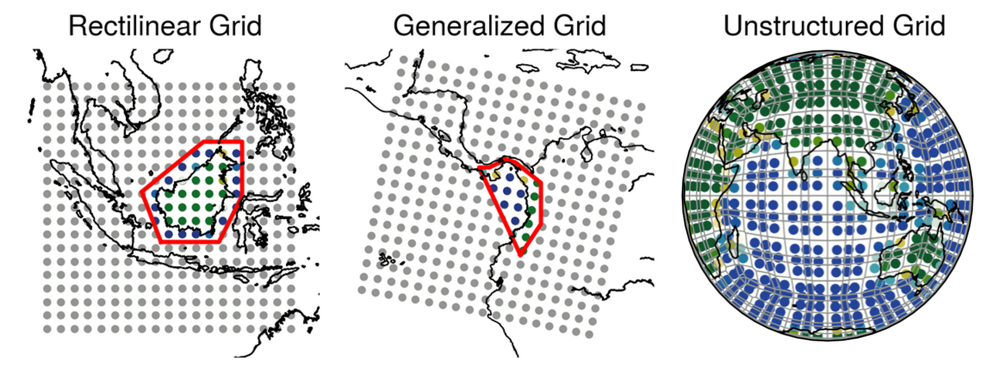

# What is a RegionGrid?

A `RegionGrid` contains information that:
* Allows us to extract gridded lon-lat data for a given `GeoRegion` (see [GeoRegions.jl](https://github.com/GeoRegionsEcosystem/GeoRegions.jl)) of interest.
* Subset the relevant longitude/latitude vectors from the initial grid.
* Allows for easy spatial-averaging of extracted gridded lon-lat data, weighted by latitude.

```@docs
RegionGrid
```

## The Types of `RegionGrid`s

The `RegionGrid` abstract type has three subtypes:
1. `RectilinearGrid` type, which is for the extraction of data on rectilinear lon-lat grids
2. `GeneralizedGrid` type, which is for the extraction of data on non-rectilinear lon-lat grids, such as a curvilinear grid.
3. `UnstructuredGrid` type, which is for the extraction of data on unstructured lon-lat grids such as a cubed-spherical grid, or an unstructured mesh.



Confusing? Fret not, it's always easier to understand by doing, so let's go through an example [here](/basics/example).