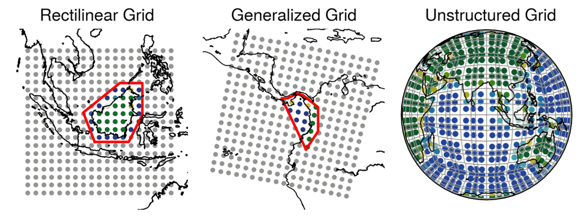

# What is a RegionGrid? {#What-is-a-RegionGrid?}

A `RegionGrid` contains information that:
- Allows us to extract gridded lon-lat data for a given `GeoRegion` (see [GeoRegions.jl](https://github.com/GeoRegionsEcosystem/GeoRegions.jl)) of interest.
  
- Subset the relevant longitude/latitude vectors from the initial grid.
  
- Allows for easy spatial-averaging of extracted gridded lon-lat data, weighted by latitude.
  
<details class='jldocstring custom-block' open>
<summary><a id='RegionGrids.RegionGrid' href='#RegionGrids.RegionGrid'><span class="jlbinding">RegionGrids.RegionGrid</span></a> <Badge type="info" class="jlObjectType jlType" text="Type" /></summary>


```julia
RegionGrid
```


Abstract supertype for geographical region gridded information.


<Badge type="info" class="source-link" text="source"><a href="https://github.com/GeoRegionsEcosystem/RegionGrids.jl/blob/76b08e60c5e247b3d19d7bc8a2ac1e2ad086691a/src/RegionGrids.jl#L17-L21" target="_blank" rel="noreferrer">source</a></Badge>

</details>


## The Types of `RegionGrid`s {#The-Types-of-RegionGrids}

The `RegionGrid` abstract type has three subtypes:
1. `RectilinearGrid` type, which is for the extraction of data on rectilinear lon-lat grids
  
2. `GeneralizedGrid` type, which is for the extraction of data on non-rectilinear lon-lat grids, such as a curvilinear grid.
  
3. `UnstructuredGrid` type, which is for the extraction of data on unstructured lon-lat grids such as a cubed-spherical grid, or an unstructured mesh.
  





Confusing? Fret not, it&#39;s always easier to understand by doing, so let&#39;s go through an example [here](/basics/example).
