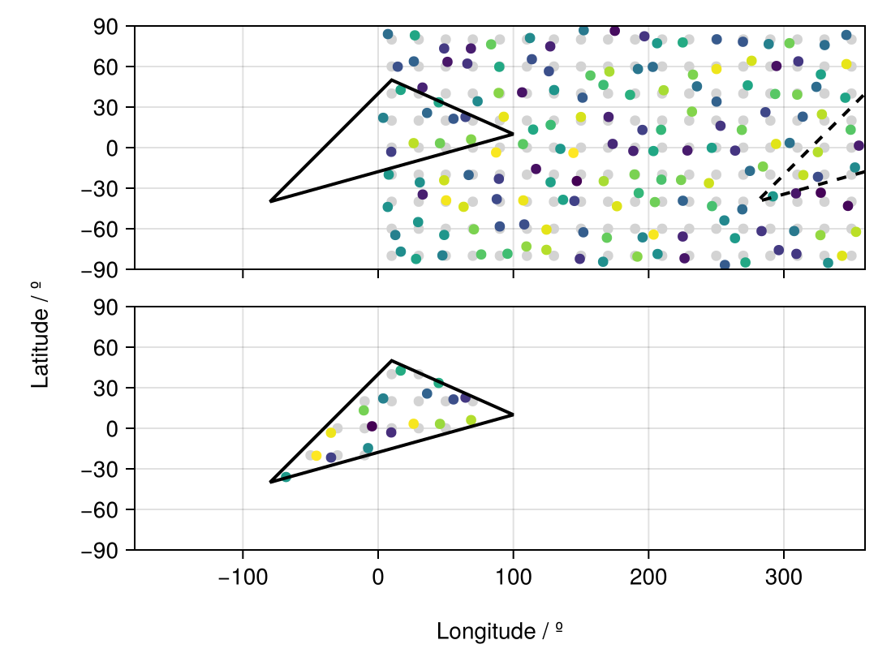

# Unstructured Grids for Data Extraction {#Unstructured-Grids-for-Data-Extraction}

There are also `RegionGrid` types without an actual grid, maybe there are a set of coordinates and geometries that define the corners or the centres of a mesh, such as:
- Model output from climate models such as cubed-sphere mesh output of the [Community Earth Systems Model 2 (CESM2)](https://www.cesm.ucar.edu/models/cesm2).
  

Basically, for each of these datasets, the data is given in such a way that the coordinates of the grid can be expressed via:
- A Vector of `Point2` types, with each `Point2` type containing (lon,lat)
  

```julia
using GeoRegions
using RegionGrids
using CairoMakie
```


## Creating Unstructured Grids {#Creating-Unstructured-Grids}

A Unstructured Grid can be created as follows:

```
ggrd = RegionGrid(geo,Point2.(lon,lat))
```


where `geo` is a `GeoRegion` of interest that is found within the domain defined by the longitude and latitude grid vectors.

```julia
lon = collect(10:20:360); nlon = length(lon)
lat = collect(-80:20:90); nlat = length(lat)

glon = zeros(nlon,nlat); glon .= lon;  glon = glon[:]
glat = zeros(nlon,nlat); glat .= lat'; glat = glat[:]

plon = glon .+ 14rand(nlon*nlat) .- 7
plat = glat .+ 14rand(nlon*nlat) .- 7

geo = GeoRegion([10,100,-80,10],[50,10,-40,50])

iggrd = RegionGrid(geo,Point2.(glon,glat))
pggrd = RegionGrid(geo,Point2.(plon,plat))
```


```ansi
The VectorMask Grid type has the following properties:
    Indices             (ipoint) : [51, 70, 71, 72, 73, 74, 75, 76, 89, 90, 91, 92, 93, 94, 108, 109, 111]
    Longitude Points       (lon) : [-68.10594792246553, -45.6164428614386, -34.80852024131923, -7.443403209558028, 9.68332382740526, 26.233973843192693, 45.71362153204072, 68.73570648563452, -34.89062640329735, -4.535886788744222, 3.745862194962516, 36.18210834762718, 55.7119854354095, 64.58297067622439, -10.61155059965023, 16.65224679545915, 44.78244964410745]
    Latitude Points        (lat) : [-36.04353568743651, -20.296630443306718, -21.628000159542758, -14.66922252554543, -3.0873422155763666, 3.3277356951004258, 3.243623029713394, 6.060519511411876, -3.31467737446549, 1.4782754990008709, 22.049025919814028, 25.664387795958774, 21.34740175838992, 22.6831123792945, 13.23319829206547, 42.67552764981302, 33.51708149062849]
    Rotated X Coordinates    (X)
    Rotated Y Coordinates    (Y)
    Rotation (°)             (θ) : 0.0
    RegionGrid Weights (weights)
    RegionGrid Size 			  : (17,) points

```


The API for creating a Unstructured Grid can be found [here](unstructured.md)

## What is in a Unstructured Grid? {#What-is-in-a-Unstructured-Grid?}
<details class='jldocstring custom-block' open>
<summary><a id='RegionGrids.UnstructuredGrid' href='#RegionGrids.UnstructuredGrid'><span class="jlbinding">RegionGrids.UnstructuredGrid</span></a> <Badge type="info" class="jlObjectType jlType" text="Type" /></summary>


```julia
UnstructuredGrid <: RegionGrid
```


A `UnstructuredGrid` is a `RegionGrid` that is created based on an unstructured grid often used in cubed-sphere or unstructured-mesh grids.

All `UnstructuredGrid` type will contain the following fields:
- `lon` - A Vector of `Float`s, defining the longitudes for each point in the RegionGrid that describe the region.
  
- `lat` - A Vector of `Float`s, defining the latitude for each point in the RegionGrid that describe the region.
  
- `ipoint` - A Vector of `Int`s, defining the indices of the valid points from the original unstructured grid that were extracted into the RegionGrid.
  
- `weights` - A Vector of `Float`s, defining the latitude-weights of each valid point in the grid. Will be NaN if outside the bounds of the GeoRegion used to define this RectilinearGrid.
  
- `X` - A Vector of `Float`s, defining the X-coordinates (in meters) of each point in the &quot;derotated&quot; RegionGrid about the centroid for the shape of the GeoRegion.
  
- `Y` - A Vector of `Float`s, defining the Y-coordinates (in meters) of each point in the &quot;derotated&quot; RegionGrid about the centroid for the shape of the GeoRegion.
  
- `θ` - A `Float` storing the information on the angle (in degrees) about which the data was rotated in the anti-clockwise direction. Mathematically, it is `rotation - geo.θ`.
  


<Badge type="info" class="source-link" text="source"><a href="https://github.com/GeoRegionsEcosystem/RegionGrids.jl/blob/76b08e60c5e247b3d19d7bc8a2ac1e2ad086691a/src/RegionGrids.jl#L80-L93" target="_blank" rel="noreferrer">source</a></Badge>

</details>


We see that in a `UnstructuredGrid` type, we have the `lon` and `lat` vectors that defined the longitude and latitude points that are within the GeoRegion.

```@example unstructured
ggrd.lon
```


```@example unstructured
ggrd.lat
```


## An example of using Unstructured Grids {#An-example-of-using-Unstructured-Grids}

Say we have some sample data, here randomly generated.

```julia
data = rand(nlon,nlat)[:]
```


```ansi
162-element Vector{Float64}:
 0.47790977032294235
 0.5645528731528144
 0.43176340502384536
 0.7262026807096821
 0.6811161357769291
 0.8204359515083242
 0.8734894752366155
 0.15024364914681365
 0.48697183378907405
 0.8059207331934107
 ⋮
 0.15234877296671467
 0.5333502402943271
 0.5981840242173146
 0.2767338349003823
 0.2645918416504113
 0.4308839262288069
 0.7714166722894026
 0.355327182663277
 0.33303663463120936
```


We extract the valid data within the GeoRegion of interest that we defined above:

```julia
ndata = extract(data,iggrd)
pdata = extract(data,pggrd)
```


```ansi
17-element Vector{Float64}:
 0.5177985800779309
 0.8937197470433758
 0.23100818059079886
 0.4684217524052644
 0.18338606320577633
 0.8828591161342846
 0.7711180223034276
 0.8005413087670187
 0.8736299544301096
 0.07730312709416554
 0.4335182585424008
 0.33456562805251333
 0.2726536163283694
 0.20933899456414917
 0.7243654575001252
 0.5762071128914796
 0.5759481863982366
```


And now let us visualize the results.

```julia
slon,slat = coordinates(geo) # extract the coordinates
fig = Figure()

ax1 = Axis(
    fig[1,1],width=450,height=150,
    limits=(-180,360,-90,90)
)
scatter!(ax1,glon,glat,color=:lightgrey)
scatter!(ax1,plon,plat,color=data)
lines!(ax1,slon,slat,color=:black,linewidth=2)
lines!(ax1,slon.+360,slat,color=:black,linewidth=2,linestyle=:dash)

hidexdecorations!(ax1,ticks=false,grid=false)

ax2 = Axis(
    fig[2,1],width=450,height=150,
    limits=(-180,360,-90,90)
)
scatter!(ax2,iggrd.lon,iggrd.lat,color=:lightgrey)
scatter!(ax2,pggrd.lon,pggrd.lat,color=pdata)
lines!(ax2,slon,slat,color=:black,linewidth=2)

Label(fig[3,:],"Longitude / º")
Label(fig[:,0],"Latitude / º",rotation=pi/2)

resize_to_layout!(fig)
fig
```

{width=549px height=413px}
